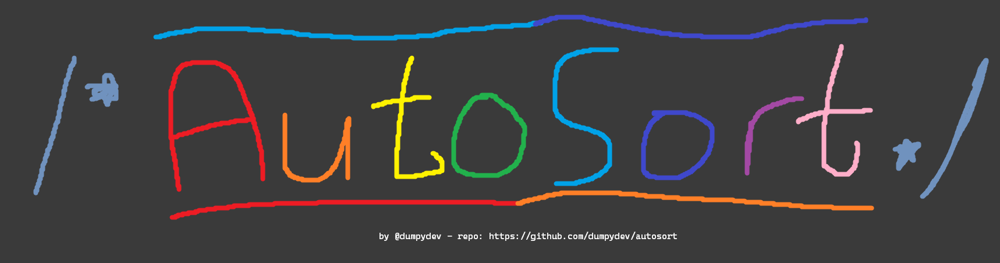

## Description
Automatically sorts your files!
## How?
- Scans current directory for files
- Detect files to be sorted
- Sorts them into folders
## Tech "Stack"
- NodeJS
## How to install?
- Download the script on GitHub.
- Run the script `node index.js`.
- If you want a folder before the subject folder, enter a folder name when asked.
- Enjoy!
## Naming Scheme
- `[SUBJECT] - [FILENAME]` - example: `ENG - essay.docx`
## All Subjects
- ENG - English
- MAT - Mathematics
- SCI - Science
- ART - Art
- PE - Physical Education
- MUS - Music
## Suggestions?
Please let me know!
## License
This is free software. You can redistribute it and/or modify it under the terms of the [GNU General Public License](https://www.gnu.org/licenses/gpl-3.0.en.html).
## Author
- [@dumpydev](https://dumpyy.xyz)
## Contributors
None yet. :(
## Version
### 1.0.0
